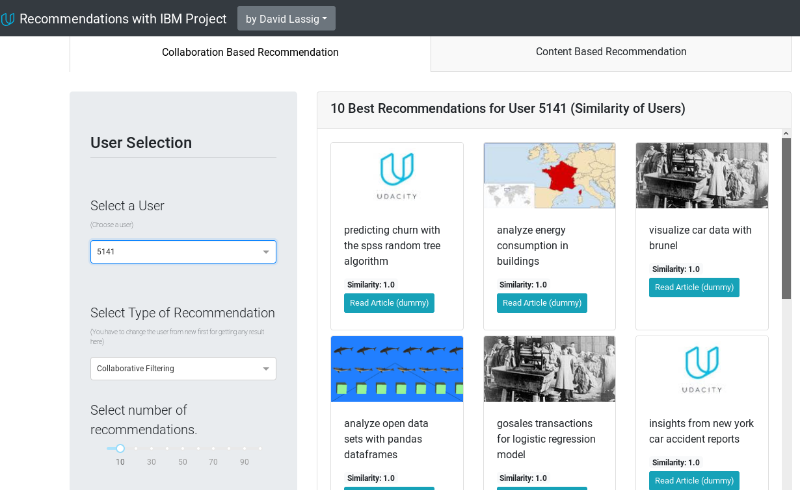
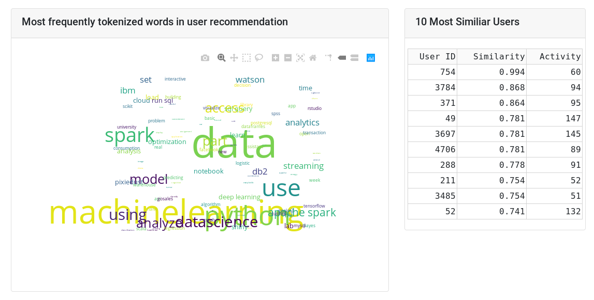

# Recommendations With IBM Webapp

This repository is a part of https://github.com/herrfeder/DataScientist/tree/master/Project_04_Recommendations_With_IBM .
It serves as a submodule for modular hosting of the webapp for this project.

## Screenshots

| Control Panel and Recommendation Area | Wordcloud and Most Similiar Users |
|--------------------------------------|--------------------------------------|
|  |  |

## Purpose

This webapp should provide a usable use-case for an recommendation engine. Therefore it combines multiple options of recommendation:
  - Singular Value Decomposition (SVD) based recommendation of similiar users.
  - Content Based recommendation based on an NLP Pipeline for similiar articles.
  - Simple Popularity based recommendation for new users.
  
It will show to the user:
  - the choosen number of recommendations for specific user or article
  - the most often occured words of the title in a wordcloud
  - the most similiar users
  
## Included Files
  
  * __Dockerfile__: Files for setting up Docker container
  * __app/data/user_item_matrix.p__: 2-dimensional DataFrame with Articles in columns and user id's as index
  * __app/data/user-item-interactions.csv__: Source data with all user interactions for all articles
  * __app/app.py__: Holds the layout and the interactivity for the Dash webapp
  * __app/plotlywordcloud.py__: Creates wordcloud, thankfully adapted from https://github.com/PrashantSaikia/Wordcloud-in-Plotly
  * __app/recommendengine.py__: Holds the classes for prepare, analyze and model the recommendation engines
  * __app/static/__: Example images from wikipedia and bootstrap css

## Webapp

An example of this web app is temporary accessible on https://federland.dnshome.de/recommendations .
Please be gentle, the resources are restricted. This app __isn't responsive__.

### Docker Instructions

1. Create directory and download Dockerfile:
    ```
    mkdir recommendation_docker && cd recommendation_docker
    wget https://raw.githubusercontent.com/herrfeder/Udacity-Project-Recommendations-With-IBM-Webapp/148b657e249c2055d48c30b28799de2e4f936e18/Dockerfile
    ```

2. Build Docker Container:
    ```
    docker build . -t recommendation_app
    ```
    As the model will be trained during Build, this will take a while.
    
3. Run Docker Container:
    ```
    docker run -p 8050:8050 recommendation_app:latest
    ```

4. Go to http://127.0.0.1:8050/

